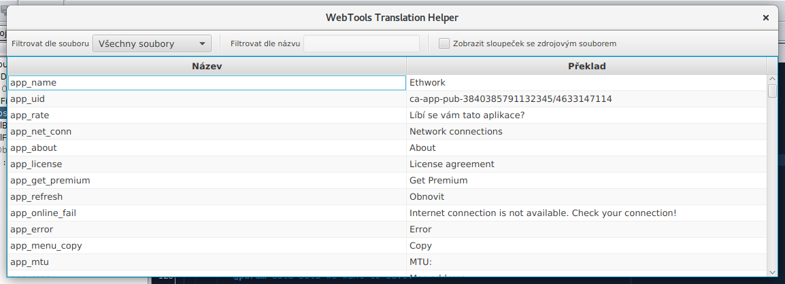

# WebTools Translation Helper

Simple [JavaFX][1] application that helps me with translation of Android application [Web Tools - Site Manager: SSH, FTP, HTTP Test][2].

## Building

Use [NetBeans IDE][3] to build this application.

## Running

Just type in terminal opened in the directory where application's JAR lives:

	java -jar webtools-trans-helper.jar

## Screenshot

[1]: https://www.java.com/
[2]: https://play.google.com/store/apps/details?id=webtools.ddm.com.webtools
[3]: http://netbeans.org/

